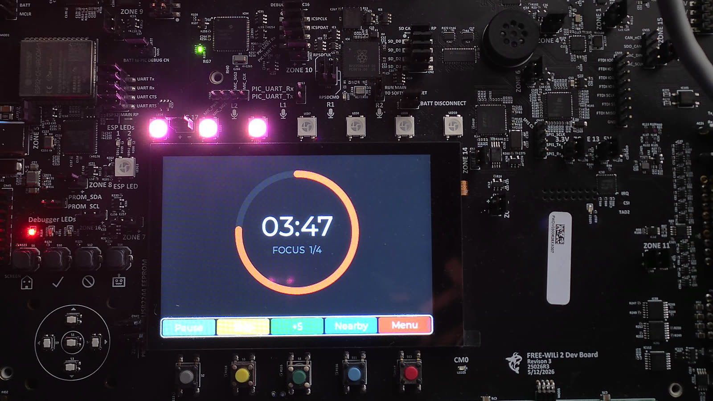
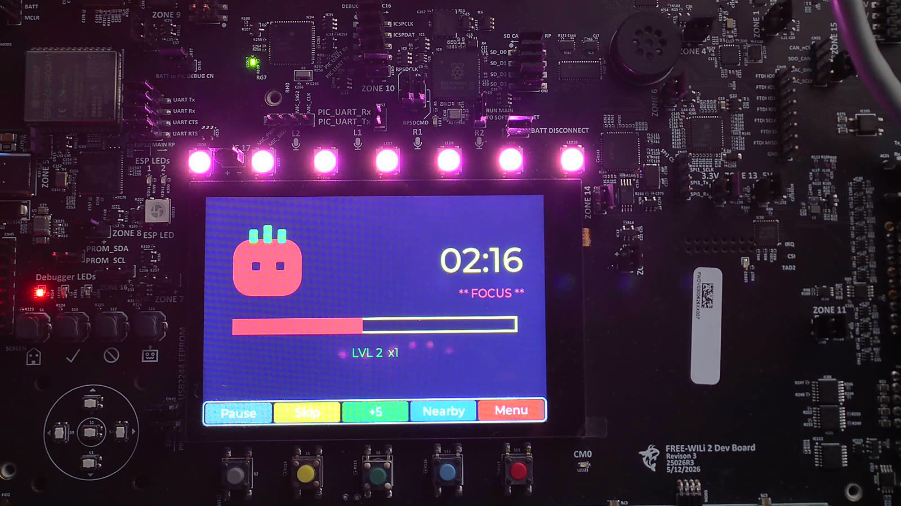
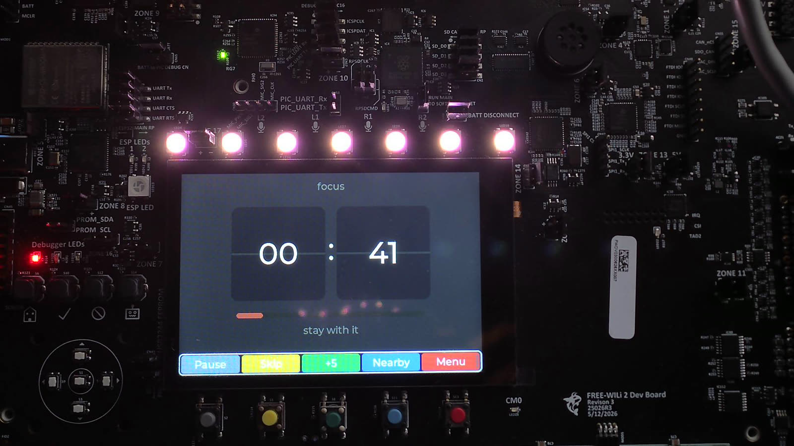
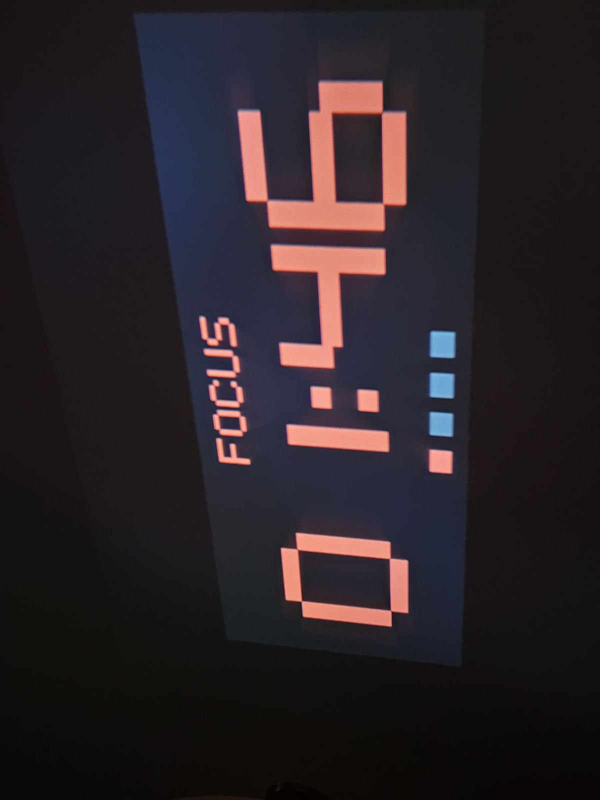

# Wilidoro

A Pomodoro timer for the [FreeWili 2](https://github.com/freewili/freewili2-docs) (RP2350B) that uses the whole board: three switchable themes on the LCD, a 16-LED progress ring, synthesized per-theme chimes, ambient auto-dim, tilt-to-pause over the IMU, a room-readable countdown on the DVI output, and a sub-GHz beacon so a room full of them can see each other's sessions.



Bare-metal C11 + Pico SDK + LVGL 9 on top of [`wilibsp`](https://github.com/freewili/wilibsp). No RTOS, no TinyUSB, fully polled.

## Highlights

- **Three complete themes**, switchable live from Settings — each owns its own face, palette, LED pattern and chime set behind one `theme_t` interface.
- **A 16-LED progress ring** that fills as the session burns down, brightness-scaled by the room.
- **Synthesized audio**, no samples: per-theme note tables driven through a sequencer into the NAU88C10.
- **Ambient auto-dim** — an OPT4001 drives both the backlight and the LED ceiling.
- **Tilt to pause** — the board lying flat is the running orientation; tip it up and the session pauses.
- **A big-room DVI display** — 640×480p60 over the RP2350's HSTX block, showing a countdown legible across a room, in the active theme's colours.
- **A sub-GHz focus beacon** — broadcasts your state at 433.92 MHz and lists nearby wilidoros on a Nearby screen.
- **An SDL simulator** that runs the same UI, app and core code on the desktop, with keyboard stand-ins for buttons, light and tilt.
- **11 host test binaries** over the hardware-free logic, run by CTest in about a second.

## Screenshots

All photographed on real hardware.

| Neon Arc | Retro Tomato Arcade | Warm Flip Clock |
|:---:|:---:|:---:|
|  |  |  |
| arc ring + `MM:SS` | tomato mascot, health bar, score | flip cards + prose status |

The DVI output on a wall through a pocket projector — same session, same theme colours, sized for a room:



## Hardware

| Part | Role | Bus |
|---|---|---|
| RP2350B | Dual Cortex-M33 MCU @ 250 MHz | — |
| ST7796 (480×320) | LCD, RGB565 | SPI1 |
| FT6336U | Capacitive touch (polled) | I²C1 @ 0x38 |
| HSTX | 640×480p60 DVI output | GPIO 12–19 |
| NAU88C10 | Audio codec → 0.5 W speaker | I²C1 + PIO0 I²S |
| 16× WS2812 | Addressable RGB LEDs | PIO1 (GPIO21) |
| OPT4001 | Ambient light (lux) | I²C1 @ 0x45 |
| BMI323 | 3-axis accel + gyro (IMU) | I²C1 @ 0x68 |
| CC1101 | Sub-GHz radio, 433.92 MHz OOK | SPI1 (shared with the LCD) + PIO2 |
| PCAL6524 | IO expander (antenna select, display reset) | I²C1 @ 0x23 |
| Button coprocessor | 5 softkeys + D-pad, unsolicited frames | UART1 @ 62500 8N1 |

Controls are the five coloured buttons (mapped to on-screen softkey columns), the D-pad, and the touchscreen.

## Building

Needs the Pico SDK and ARM GCC under `~/.pico-sdk` (the layout the official VS Code extension installs), plus CMake and Ninja.

```sh
git clone --recurse-submodules https://github.com/freewili/wilidoro.git
cd wilidoro
powershell -File tools/build.ps1          # -> build/wilidoro.uf2
powershell -File tools/flash.ps1          # program + verify + reset over a CMSIS-DAP probe
```

Add `-Clean` to `build.ps1` for a from-scratch build. `tools/rtt.ps1` streams SEGGER RTT diagnostics.

Drag-and-drop also works: hold BOOTSEL, then copy `build/wilidoro.uf2` to the mass-storage device.

### Host tests

```sh
powershell -File tools/test.ps1           # configure, build, ctest
```

Needs a host GCC (MSYS2 mingw64 works). 11 binaries, ~1 second.

### Simulator

```sh
powershell -File tools/sim.ps1
```

Needs SDL2 in MSYS2 (`pacman -S mingw-w64-x86_64-SDL2`). Keyboard: `Z X C V B` are the five softkeys, arrows + Enter are the D-pad, `[` / `]` vary the fake ambient light, `-` / `=` tilt the fake board. A second window mirrors the DVI output.

## Architecture

The rule that shapes everything: **the HAL is the only hardware seam**, so the interesting logic is testable on a desktop.

```
src/core/     pure logic, zero dependencies — pomodoro FSM, beacon codec, tilt gate, dimming curve
src/app/      pure app logic + the LVGL-aware controller — timer_view, led_pattern, sound, dvi_view
src/ui/       LVGL screens and the three themes
src/hal/      hal.h is the seam; hal_target.c (wilibsp) and hal_sim.c (SDL) are its only implementations
src/target/   device main + LVGL display/touch port
src/sim/      desktop main
tests/        greatest.h unit tests over src/core and src/app
```

`src/core/` and most of `src/app/` never include a `wilibsp`, SDL or LVGL header, which is what lets CTest cover the pomodoro state machine, the OOK framer, the tilt hysteresis, the LED patterns and the DVI renderer without a board.

A few details worth knowing if you're reading the code:

- **The pomodoro FSM is a pure function of time.** No timers inside it; the controller feeds it `now_ms` and it returns events.
- **Every deadline uses `(int32_t)(now - deadline) >= 0`**, never `now >= deadline`, because the millisecond clock wraps every ~49 days. There were real bugs here.
- **`dvi_view` writes through a single clipped `fill_rect`.** The HSTX framebuffer is strided, and the bytes past each row's width are live scanout command words — overrun them and you corrupt the display program, not just a pixel. Its unit tests render into sentinel-filled slack to prove nothing escapes.
- **SPI1 is shared** between the LCD and the CC1101, including GPIO8 doing double duty as the LCD's DC line and the radio's MISO. The BSP's `spi_bus` arbiter owns that handoff; the display flush is deliberately left blocking so there is exactly one bus owner at any instant.
- **PIO0 runs I²S audio, PIO1 the LEDs, PIO2 the radio capture.** All three at once.

## What is verified, and what isn't

This repo tries to be honest about the difference between "host-tested" and "seen working on a board". [`docs/hardware-notes.md`](docs/hardware-notes.md) is the record, including the bench-tuned constants and per-feature on-device checklists.

**Confirmed on hardware:** the display and touch, all three themes plus live theme switching, the LED brightness ceiling, the audio chimes (level-checked by ear and by a Goertzel analysis of a microphone capture), the DVI output on a projector at the board's default 250 MHz, and tilt-to-pause.

**Not confirmed:** the sub-GHz beacon. The radio brings up and the firmware runs clean alongside it, but over-the-air *reception* has never been demonstrated on this hardware by anyone — proving it needs a second transmitter. A boot self-test transmits a frame and re-captures it on the same pad, which exercises the whole chain except the RF air path; its result is logged over RTT. The beacon is off by default.

## Design docs

`docs/superpowers/` holds the design specs and implementation plans the features were built from, and the handoff notes between sessions. They are the reasoning behind the code — most usefully the beacon design, which documents why the OOK receive framer has to flush on a quiet line instead of waiting for an idle gap.

## Credits

Built on [`wilibsp`](https://github.com/freewili/wilibsp), whose radio drivers were harvested from [`subghz`](https://github.com/freewili/subghz). UI by [LVGL 9](https://lvgl.io). Unit tests use [greatest](https://github.com/silentbicycle/greatest).

## License

MIT — see [LICENSE](LICENSE).
