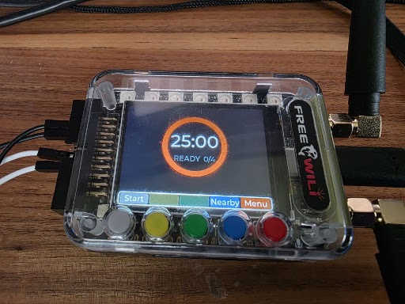

# Wilidoro

A Pomodoro timer for the [FreeWili 2](https://github.com/freewili/freewili2-docs) (RP2350B) that uses the whole board: three switchable themes on the LCD, a 16-LED progress ring, synthesized per-theme chimes, ambient auto-dim, tilt-to-pause over the IMU, a room-readable countdown on the DVI output, and a sub-GHz beacon so a room full of them can see each other's sessions.

Wilidoro also now runs on the **FreeWili OG** (FreeWili 1 / Classic, two RP2040s) as a second board target. See [FreeWili OG](#freewili-og) below for what works there today and how to build it — the FW2 content above and through "Architecture" describes the original, more full-featured board.


Bare-metal C11 + Pico SDK + LVGL 9 on top of [`wilibsp`](https://github.com/freewili/wilibsp). No RTOS, no TinyUSB, fully polled.

## Highlights

- **Three complete themes**, switchable live from Settings — each owns its own face, palette, LED pattern and chime set behind one `theme_t` interface.
- **A 16-LED progress ring** that fills as the session burns down, brightness-scaled by the room.
- **Synthesized audio**, no samples: per-theme note tables driven through a sequencer into the NAU88C10.
- **Ambient auto-dim** — an OPT4001 drives both the backlight and the LED ceiling.
- **Tilt to pause** — the board lying flat is the running orientation; tip it up and the session pauses.
- **A big-room DVI display** — 640×480p60 over the RP2350's HSTX block, showing a countdown legible across a room, in the active theme's colours.
- **A sub-GHz focus beacon** — broadcasts your state at 433.92 MHz and lists nearby wilidoros on a Nearby screen.
- **An SDL simulator** that runs the same UI, app and core code on the desktop, with keyboard stand-ins for buttons, light and tilt.
- **13 host test binaries** over the hardware-free logic, run by CTest in about a second.

## Screenshots

All photographed on real hardware.

| Neon Arc | Retro Tomato Arcade | Warm Flip Clock |
|:---:|:---:|:---:|
|  |  |  |
| arc ring + `MM:SS` | tomato mascot, health bar, score | flip cards + prose status |

The DVI output on a wall through a pocket projector — same session, same theme colours, sized for a room:


The projector in that photo is an inexpensive [1080p WiFi/Bluetooth mini projector](https://www.amazon.com/dp/B0F7RR3YC6), fed from the board's HSTX pins through a plain DVI→HDMI cable. Nothing about it is special, which is the point: it accepted the 640×480p60 signal at the board's default 250 MHz clock — a pixel clock 0.7 % below the 25.175 MHz standard — and upscaled it to the wall without complaint. See [`docs/hardware-notes.md`](docs/hardware-notes.md#dvi-output--region-size-and-pixel-clock) for what to do if some other display refuses to sync.

## Hardware

| Part | Role | Bus |
|---|---|---|
| RP2350B | Dual Cortex-M33 MCU @ 250 MHz | — |
| ST7796 (480×320) | LCD, RGB565 | SPI1 |
| FT6336U | Capacitive touch (polled) | I²C1 @ 0x38 |
| HSTX | 640×480p60 DVI output | GPIO 12–19 |
| NAU88C10 | Audio codec → 0.5 W speaker | I²C1 + PIO0 I²S |
| 16× WS2812 | Addressable RGB LEDs | PIO1 (GPIO21) |
| OPT4001 | Ambient light (lux) | I²C1 @ 0x45 |
| BMI323 | 3-axis accel + gyro (IMU) | I²C1 @ 0x68 |
| CC1101 | Sub-GHz radio, 433.92 MHz OOK | SPI1 (shared with the LCD) + PIO2 |
| PCAL6524 | IO expander (antenna select, display reset) | I²C1 @ 0x23 |
| Button coprocessor | 5 softkeys + D-pad, unsolicited frames | UART1 @ 62500 8N1 |

Controls are the five coloured buttons (mapped to on-screen softkey columns), the D-pad, and the touchscreen.

## FreeWili OG

The **FreeWili OG** (FreeWili 1 / Classic) is a second, supported board target: two RP2040s (a "display" CPU and a "main" CPU), an ST7789 320×240 panel, 7 WS2812 LEDs and 5 buttons — no touch, no light sensor, no DVI. `src/core/`, `src/app/` and `src/ui/` are shared verbatim with the FW2; only `src/hal/` differs per board.



Neon Arc on real OG hardware, idle and ready for the first of four sessions. The five physical buttons drive the softkey columns along the bottom — `Start`, `Nearby`, `Menu` — and both CC1101 antennas are the beacon's transmit and listen radios on the main CPU.

**Working today (Plan A):** the Neon Arc theme, relaid out for 320×240; the 5 physical buttons driving the same softkey columns as the FW2; the panel itself, including the bounded ST7789 init the display CPU must run on every boot.

**Also hardware-verified (Plan OG-B tasks 1–4):** the 7-LED WS2812 ring and synthesized chimes over I2S (tasks 1-3); tilt-to-pause over the LIS3DH (task 4) — the board lying flat is the running orientation, tip it up and the session pauses, same gesture as the FW2. `hal_caps().imu` reflects whether `lis3dh_configure()` actually found the part at boot, not a hardcoded `true`, so a dead sensor shows up as "no imu" in Settings instead of a toggle that silently does nothing.

**Also built (Plan OG-C), but only ever exercised in the SDL simulator, never on a board:** all three themes (Neon Arc, Retro Tomato Arcade, Warm Flip Clock) relaid out for 320×240, live theme switching, and the Settings and Nearby screens driven entirely from the five-button arrow pad. `hal_caps()` now reports `leds=true` and `audio=true` on the OG, since both are real.

**Also built (Plan OG-D), and the radio half hardware-verified:** the sub-GHz beacon. The display CPU has no radio, so `hal_beacon_tx/rx` are messages over the inter-CPU link to the main CPU, which owns both CC1101s at 433.92 MHz — `CS0` transmits, `CS1` listens. A boot self-test sends a real beacon frame between the two on-board radios **over the air** and passes: RSSI −54 dBm, LQI 0–2, CRC OK across four boots. `hal_caps().radio` is not a constant — it means "the main CPU has reported both radios up within the last 15 s", measured to go false 12 s after the main CPU is removed.

What has **not** been seen: anything on the panel. Nearby's contents and its `+Self`/`-Self` toggle are unobserved — see the checklist in [`docs/hardware-notes.md`](docs/hardware-notes.md). The beacon is off by default (it broadcasts your name and state unauthenticated), so Settings has to enable it first.

### Building and flashing the OG

```sh
powershell -File tools/build_og.ps1       # -> build-og/wilidoro_display.uf2, build-og/wilidoro_main.uf2
powershell -File tools/flash_og.ps1       # flashes wilidoro_main (the only app you may flash — see below)
```

`-DWILIDORO_BOARD=fw2|og` is what selects the target; `tools/build.ps1` and `tools/build_og.ps1` are thin wrappers around it that also point CMake at the right board config and build directory (`build/` vs `build-og/`). `PICO_BOARD` is a single global CMake cache value, so one configure cannot produce both boards — always go through the two build scripts, not a hand-rolled `cmake` invocation.

**A display application must never be UF2-flashed. This is not a style preference — it bricks the display CPU's USB.** The display CPU has no BOOTSEL button; the only way to update it is for the main CPU to push the display image over the inter-CPU link, metadata sector and all. Only `wilidoro_main` gets flashed by UF2 — it embeds the display image and carries it across at boot. `tools/flash_og.ps1` enforces this: it refuses outright if you ask it to flash anything named `*_display`.

## Building

Needs the Pico SDK and ARM GCC under `~/.pico-sdk` (the layout the official VS Code extension installs), plus CMake and Ninja.

```sh
git clone --recurse-submodules https://github.com/freewili/wilidoro.git
cd wilidoro
powershell -File tools/build.ps1          # -> build/wilidoro.uf2
powershell -File tools/flash.ps1          # program + verify + reset over a CMSIS-DAP probe
```

Add `-Clean` to `build.ps1` for a from-scratch build. `tools/rtt.ps1` streams SEGGER RTT diagnostics.

Drag-and-drop also works: hold BOOTSEL, then copy `build/wilidoro.uf2` to the mass-storage device.

### Host tests

```sh
powershell -File tools/test.ps1           # configure, build, ctest
```

Needs a host GCC (MSYS2 mingw64 works). 11 binaries, ~1 second.

### Simulator

```sh
powershell -File tools/sim.ps1
```

Needs SDL2 in MSYS2 (`pacman -S mingw-w64-x86_64-SDL2`). Keyboard: `Z X C V B` are the five softkeys, arrows + Enter are the D-pad, `[` / `]` vary the fake ambient light, `-` / `=` tilt the fake board. A second window mirrors the DVI output.

The simulator is a separate CMake project from the root and defaults to the FreeWili 2. Give it `-Board og` to run the OG's 320×240 layout instead, in its own build directory (`build-sim-og`, vs. `build-sim` for the FW2) so one CMake cache never has to hold both boards:

```sh
powershell -File tools/sim.ps1 -Board og
```

`Z X C V B` still work, and drive the same five softkey columns the real OG's five physical buttons do — on the OG's Settings screen that is an arrow pad (grey/red move the selection, yellow/blue adjust it, green applies). What the OG simulator does *not* faithfully reproduce:

- **No DVI mirror window.** The OG has no HSTX block, so `sim_dvi_create()`/`sim_dvi_present()` are skipped entirely, same as the real board never running `dvi_view.c`.
- **7 LEDs, not 16** — `hal_led_count()` returns the OG's real WS2812 chain length.
- **No radio, and no inter-CPU link.** The simulator models neither, so `hal_caps()` reports `radio=false` and `hal_beacon_rx()` returns `false` in OG mode — the fake "JEN" neighbour the FW2 sim uses to exercise Nearby is off here and Nearby stays empty. This is **no longer** "same as the real board": since Plan OG-D the real OG does have a working beacon. It is a limit of the simulator, not of the hardware. Nearby's `+Self` toggle renders and flips but has nothing to reveal.
- **No light sensor** — `hal_lux()` returns `false`, matching `hal_og.c`.
- **The `-` / `=` fake-tilt keys now work in OG mode, same as on the FW2 sim.** `hal_imu()` shares one fake-tilt implementation across both boards' simulators now that tilt-to-pause has landed on real OG hardware (`hal_og.c`'s LIS3DH driver) as well as the FW2's — toggle Tilt-to-pause on in Settings, hold `-`/`=` past the hysteresis band, and a running session actually pauses/resumes, exercising the same shared `tilt.c` gate real hardware drives.
- **The sim is slightly more capable than the OG hardware in one respect**: LVGL's SDL build always provides a mouse pointer indev, so in OG mode you can click the on-screen `+`/`-` buttons with the mouse in addition to using the `Z X C V B` arrow pad. The real OG has no touchscreen and no pointer device at all — only the arrow pad works there. This is a simulator fidelity gap, not a bug.

## Architecture

The rule that shapes everything: **the HAL is the only hardware seam**, so the interesting logic is testable on a desktop.

```
src/core/     pure logic, zero dependencies — pomodoro FSM, beacon codec, tilt gate, dimming curve
src/app/      pure app logic + the LVGL-aware controller — timer_view, led_pattern, sound, dvi_view
src/ui/       LVGL screens and the themes, shared between both boards
src/hal/      hal.h is the seam; hal_target.c (FW2/wilibsp), hal_sim.c (SDL) and hal_og.c (OG display CPU) are its implementations
src/target/   FW2 device main + LVGL display/touch port
src/target_og/  OG display-CPU main + LVGL/ST7789 port
src/main_og/  OG main-CPU radio app — exists to carry the display image over the inter-CPU link
src/sim/      desktop main
tests/        greatest.h unit tests over src/core and src/app
```

`src/core/` and most of `src/app/` never include a `wilibsp`, SDL or LVGL header, which is what lets CTest cover the pomodoro state machine, the OOK framer, the tilt hysteresis, the LED patterns and the DVI renderer without a board.

A few details worth knowing if you're reading the code:

- **The pomodoro FSM is a pure function of time.** No timers inside it; the controller feeds it `now_ms` and it returns events.
- **Every deadline uses `(int32_t)(now - deadline) >= 0`**, never `now >= deadline`, because the millisecond clock wraps every ~49 days. There were real bugs here.
- **`dvi_view` writes through a single clipped `fill_rect`.** The HSTX framebuffer is strided, and the bytes past each row's width are live scanout command words — overrun them and you corrupt the display program, not just a pixel. Its unit tests render into sentinel-filled slack to prove nothing escapes.
- **SPI1 is shared** between the LCD and the CC1101, including GPIO8 doing double duty as the LCD's DC line and the radio's MISO. The BSP's `spi_bus` arbiter owns that handoff; the display flush is deliberately left blocking so there is exactly one bus owner at any instant.
- **PIO0 runs I²S audio, PIO1 the LEDs, PIO2 the radio capture.** All three at once.

## What is verified, and what isn't

This repo tries to be honest about the difference between "host-tested" and "seen working on a board". [`docs/hardware-notes.md`](docs/hardware-notes.md) is the record, including the bench-tuned constants and per-feature on-device checklists.

**Confirmed on hardware:** the display and touch, all three themes plus live theme switching, the LED brightness ceiling, the audio chimes (level-checked by ear and by a Goertzel analysis of a microphone capture), the DVI output on a projector at the board's default 250 MHz, and tilt-to-pause.

**Not confirmed on the FreeWili 2:** its sub-GHz beacon. The radio brings up and the firmware runs clean alongside it, but over-the-air *reception* has never been demonstrated on that board by anyone — proving it needs a second transmitter. Its boot self-test transmits a frame and re-captures it on the same pad, which exercises the whole chain except the RF air path; its result is logged over RTT. The beacon is off by default.

**Confirmed on the FreeWili OG, and this is the difference:** the OG has two CC1101s, so its self-test transmits on one and receives on the other **through the air** — the proof the FW2's same-pad loopback could never be. It passes (RSSI −54 dBm, LQI 0–2, CRC OK). What is still unconfirmed there is the *screen*: nobody has watched Nearby populate.

## Design docs

`docs/superpowers/` holds the design specs and implementation plans the features were built from, and the handoff notes between sessions. They are the reasoning behind the code — most usefully the beacon design, which documents why the OOK receive framer has to flush on a quiet line instead of waiting for an idle gap.

## Credits

Built on [`wilibsp`](https://github.com/freewili/wilibsp), whose radio drivers were harvested from [`subghz`](https://github.com/freewili/subghz). UI by [LVGL 9](https://lvgl.io).

### Third-party components

Wilidoro's own code is MIT. These vendored files and submodules keep their own terms:

| Component | Where | License |
|---|---|---|
| [greatest](https://github.com/silentbicycle/greatest) | `tests/greatest.h` | ISC — © 2011–2021 Scott Vokes |
| Pico SDK import shim | `pico_sdk_import.cmake` | BSD-3-Clause — © Raspberry Pi Ltd |
| [LVGL](https://github.com/lvgl/lvgl) 9.2.2 | `third_party/lvgl` submodule; `config/lv_conf.h` derived from its template | MIT |
| [`wilibsp`](https://github.com/freewili/wilibsp) | `wilibsp` submodule (FreeWili 2) | see that repository |
| [`wiliOGbsp`](https://github.com/freewili/wiliOGbsp) | `wiliOGbsp` submodule (FreeWili OG) | see that repository |

## License

MIT — see [LICENSE](LICENSE).
